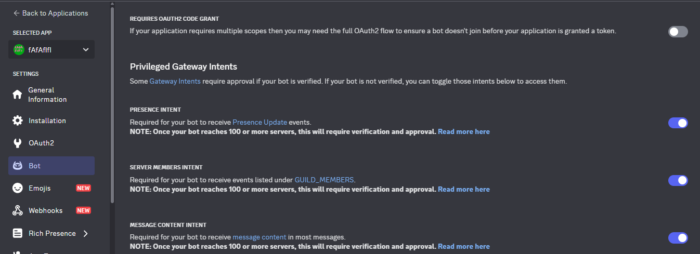
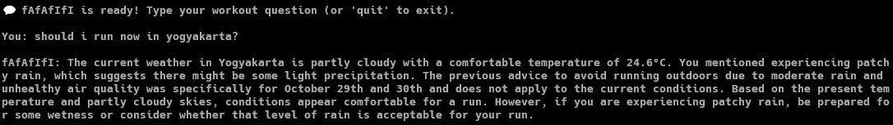
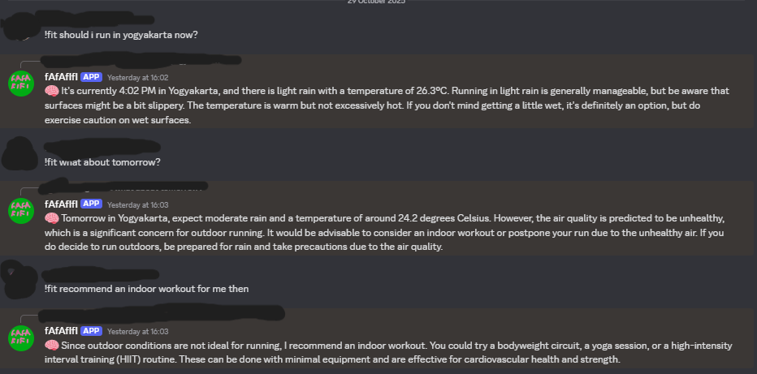

# FAFAFIFI THE SECRET AGENT 002
This is a llm agent chatbot.
## Background
I enjoy working out, whether it’s strength training or cardiovascular exercise, and that passion inspired me to build this chatbot. The main purpose of the chatbot is to provide feedback on workouts, track progress, and help monitor injuries. By combining simple rules with structured responses, the chatbot will serve as a workout companion—helping me stay consistent, safe, and motivated in my fitness journey.
## How to Setup and Run
### Clone Repository
Clone this repo to your local device with whatever technique you like and open the project
### Create Virtual Environment 
Create virtual environment for this project to avoid dependencies hell with existing project in your device, you can use whatever library you like.
### Migrate to Virtual Environment
Don't forget to migrate to your virtual environment everytime you open this project!!!!!!
### Install Dependencies
Install the required dependencies with this command.
```bash
pip install -r requirements.txt
```
### Set up .env
Make your .env file like .env.example and copy all the suitable key there. External API used are listed below:

Serp API -> [Google Search API](https://serpapi.com/)

Weather API -> [Weather API](https://www.weatherapi.com/)

### Run the Bot
#### CLI Mode
To run the bot in CLI Mode, you just need to run the client.py and mcp_server.py file with this command.
```bash
python client.py mcp_server.py
```
#### Discord Mode
To run the bot in Discord Mode, you need to do a few steps, or you can simply use the [fafafifi bot invitation](https://discord.com/oauth2/authorize?client_id=1413929581139857470&permissions=67584&integration_type=0&scope=bot) to invite the bot I've already made to your server and skip all the steps (Remember that my bot will only work whenever I run my discord_bot.py file locally so proceed with caution).
##### Create Discord Application
Create your own discord application first, you can create your application here https://discord.com/developers/applications (Don't forget to copy the app token because we gonna use that to connect your bot to the core bot)
##### Setup Discord Application
Basically, you just need to activate the privileged gateway intents on the bot sections to setup.

##### Invite Bot to Server
Go to OAuth2 page on your application and check `bot` on scope and add at least `Send Messages` permission for your bot, then you pick `Guild Install` as the integration type and copy the generated url then click to invite your bot the desired server.
##### Save Token in Environtment Variable
Copy your token to your DISCORD_TOKEN variable in .env file

##### Run Bot
Once your bot arrived at the server, you just need to run the discord_bot.py with this command:
```bash
python discord_bot.py
```
## Demo
### CLI Mode
To test the bot, you just need to type anything in the terminal after you run the file. To exit, you just need to press `CTRL + C` or type `quit`. All the chat logs on CLI mode will be written in the file called `logs.txt` that is located on the `\logs` folder.


### Discord Mode

To test the bot, you just need to send message in your server with !fit command like this:


